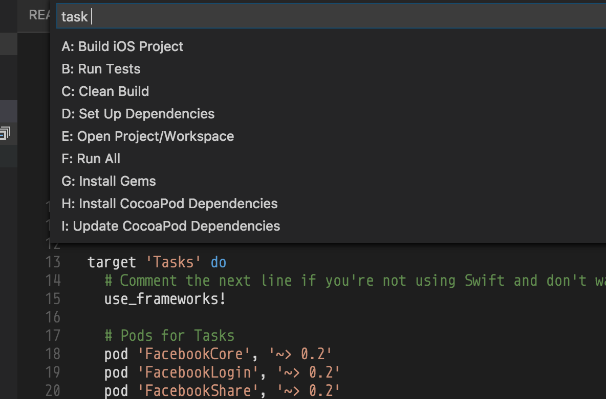

# Tasks for Xcode

Various tasks are necessary for working with Xcode projects. 

The most common tasks include the following:

* Editing markdown (README.md)
* Editing Podfile/Gemfile
* Running tasks to install, build and test
* Managing image assets (Sketch, PaintCode, etc)
* Managing other resources

The more complex tasks are related to managing dependencies with [CocoaPods]. Instead of being focused on iOS and Swift a developer must learn about installing and managing Ruby gems which is the underlying technology of CocoaPods.

The linked instructions below can get you started with [CocoaPods] and managing a [Gemfile] so you can keep your tools in sync across your team.

## Getting Started

* [Setup for CocoaPods]
* [Gemfiles for CocoaPod Versions]
* [Gemfiles]

## Command-Line

The following commands must be used to set up and keep your project current for day to day development.

 * `bundle install`
 * `bundle exec pod install`
 * `bundle exec pod update`

You may not use a Gemfile and in that case you may not use the `bundle` command at all. The policy may change from project to project.

## Shell Scripting

In order to make a project easier to work with among many projects it is best script the common tasks. When a project is first clone from a git repository the setup routines. For CocoaPods managed with a Gemfile these tasks include installing the bundle and then the pods. Then from time to time as the pods are updated to new versions the `pod install` or `pod update` command would used.

For many who prefer to stay in Xcode and work with Swift these commands are a bit much. And when there are nuances between multiple projects it can be easy to run the wrong command. A common mistake is running `pod install` when `bundle exec pod install` should be used.

By using a shell script which is managed with source control for each project along with a Gemfile it is possible to make a project much easier to manage. If a new requirement is introduced it can be added to the shell script and even without knowing about it the team will benefit from the update without their work being distrupted.

## Tasks with Visual Studio Code

Going a step further, [Visual Studio Code] can be used. It is free and runs on the Mac as well as Linux and Windows. The following reasons make it an excellent companion for development with Xcode.

* Strong support for markdown to ease documentation creation
* Plugin support for common files in iOS
* Syntax highlighting for Podfile & Gemfile
* Integrated Terminal to run commands and show output

See: [iOS Common Files] (thanks to [Orta])

With the [tasks.sh] shell script and [tasks.json] to configure VSCode commands can be run from the task runner with key combination of cmd-shift-r. Selecting one of the configured tasks will start the script for that task with the output showing in the embedded console. You can do all of your work between Xcode and VSCode.

Currently the following commands are supported.

* build 
* clean
* setup
* all
* bundle-install
* pod-install
* pod-update

Each of these commands can be configured with variables at the top of the shell script and each of the tasks is define as a function which can be updated to run as many commands as needed.

## Continuous Integration

While the task runner provides a helpful interface it is also possible to run the tasks with the script from the command-line by passing in the argument used to run as task. The same scripts you use daily for development can also be used for continuous integration. Specifically the test task will execute the tests with output which your CI server can use to evaluate each of the tests. 

## Key Bindings

Xcode has number key bindings for all of the sections in the left side bar and switching between these sections is very easy. It is possible to configure VSCode to work in the same way. It can be done from the top menu under *Preferences*. Using [keybindings.json] to configure your key bindings will make VSCode work a lot like Xcode. And executing tasks can be done with CMD-E with this configuration as well as CMD-1 through CMD-5 to change between sections in the side bar and CMD-0 to toggle the side bar. 

## Integrated Terminal

Using the integrated terminal is easy though it may need to be configured. If your computer was set up by IT they may have tried to lock it down by setting your shell to `/bin/false`. It happened to me. I simply ran `chsh -s /bin/bash` to set it correctly. I also usually configure `~/.bash_profile` and don't change `~/.bashrc` which is used for interactive shells, like the one VSCode creates. I create a symlink for `.bashrc` to `.bash_profile` so I always have my configuration settings. Setting the `$PATH` so that CocoaPods is accessible is important for these tasks. 

If you find your integrated terminal in VSCode is not opening it could be the path for your working folder has special characters which is causing it to fail or your shell is not configured properly. Check the [VSCode GitHub repository] for issues related to this problem to potentially find a solution.

## Source Control Not Included

Keeping the scripts for these tasks in sync with the rest of the project should be done with source control. Including a set of tasks for working with `git` would allow for pulling the latest changes, perhaps only doing so when the current branch is `master` and there are no local changes. A simple `git pull` may be all that is needed or `git pull --rebase` if that works better with how you work with `git`. Managing a local `git` repository is beyond the scope of this sample project.

If you were to include source control task it is important to remember that it is necessary to sync up with the latest changes for task scripts before running other tasks which may change with the project. First the script to update the local copy must be completed for other tasks can be run.

---
Brennan Stehling - 2016

[CocoaPods]: https://www.cocoapods.org/
[Setup for CocoaPods]: https://gist.github.com/brennanMKE/372890aa27d4b90a1533aeb3c26e06e4
[Ruby]: http://www.ruby-lang.org/en/
[Gemfiles]: https://gist.github.com/brennanMKE/dff7b89836af5e51bcda0bda89967617
[Gemfiles for CocoaPod Versions]: https://gist.github.com/brennanMKE/dff7b89836af5e51bcda0bda89967617
[Visual Studio Code]: http://code.visualstudio.com/
[VSCode GitHub repository]: https://github.com/Microsoft/vscode/
[iOS Common Files]: https://marketplace.visualstudio.com/items?itemName=Orta.vscode-ios-common-files
[Orta]: http://twitter.com/orta
[tasks.sh]: tasks.sh
[tasks.json]: .vscode/tasks.json
[keybindings.json]: keybindings.json